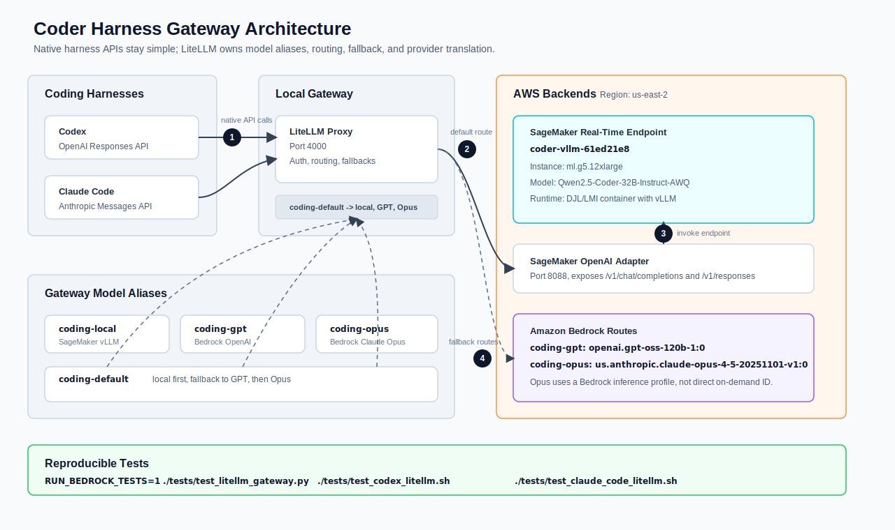

# Coder Harness Gateway

Deployment and test skeleton for connecting coding harnesses to a mixed model fleet:

- Codex through an OpenAI-compatible provider.
- Claude Code through an Anthropic Messages-compatible provider.
- A self-hosted coder model served by vLLM on SageMaker.
- Bedrock-hosted GPT and Claude Opus routes for fallback and comparison.

The central design choice is a model gateway. Harnesses should use the API shape they already expect; the gateway owns routing, auth, fallback, logging, and provider translation.

## Target Architecture



```text
Codex CLI / IDE       -> OpenAI Responses API         -> LiteLLM Proxy
Claude Code           -> Anthropic Messages API       -> LiteLLM Proxy
Internal agents       -> OpenAI-compatible API        -> LiteLLM Proxy

LiteLLM Proxy         -> SageMaker OpenAI adapter     -> SageMaker vLLM endpoint
LiteLLM Proxy         -> Amazon Bedrock OpenAI GPT OSS
LiteLLM Proxy         -> Amazon Bedrock Claude Opus
```

## Current Deployment

The deployed local coder route is:

- Endpoint: `coder-vllm-61ed21e8`
- Region: `us-east-2`
- Model: `Qwen/Qwen2.5-Coder-32B-Instruct-AWQ`
- Runtime: AWS DJL/LMI container with vLLM
- Instance: `ml.g5.12xlarge`

`ml.g5.12xlarge` is used because this account currently has zero SageMaker endpoint quota for `ml.g6e.*` in `us-east-2`. Once quota is raised, deploy with:

```bash
INSTANCE_TYPE=ml.g6e.2xlarge ./deploy/sagemaker-vllm/deploy.sh
```

## Model Aliases

Harnesses should use aliases, not provider model IDs:

- `coding-default`: local SageMaker/vLLM first, fallback to GPT, then Opus.
- `coding-local`: SageMaker/vLLM `Qwen2.5-Coder-32B-Instruct-AWQ`.
- `coding-gpt`: Bedrock `openai.gpt-oss-120b-1:0`.
- `coding-opus`: Bedrock inference profile `us.anthropic.claude-opus-4-5-20251101-v1:0`.
- `coding-strong`: explicit premium Opus route.

## Repository Layout

```text
coder-harness-gateway/
├── .gitignore
├── README.md
├── SPEC.md
├── clients/
│   ├── claude-code/
│   │   ├── env.example
│   │   └── litellm-sagemaker-bedrock.env
│   └── codex/
│       ├── config.toml.example
│       └── litellm-sagemaker-bedrock.config.toml
├── config/
│   └── litellm/
│       ├── config.example.yaml
│       └── sagemaker-bedrock.config.yaml
├── deploy/
│   ├── aws-g6e/                  # Legacy EC2/G6e experiment; SageMaker is the active path
│   │   ├── README.md
│   │   ├── deploy.sh
│   │   ├── main.tf
│   │   ├── outputs.tf
│   │   ├── user_data.sh.tftpl
│   │   ├── variables.tf
│   │   └── versions.tf
│   ├── sagemaker-vllm/
│   │   ├── README.md
│   │   ├── deploy.sh
│   │   ├── main.tf
│   │   ├── outputs.tf
│   │   ├── variables.tf
│   │   └── versions.tf
│   └── vllm-g6e/
│       └── run-vllm-qwen-coder.sh
├── docs/
│   ├── architecture.svg
│   ├── decisions.md
│   ├── deployment-log.md
│   └── harness-orchestration.md
├── examples/
│   ├── code-edit-request.json
│   └── sagemaker-payload.json
├── scripts/
│   ├── run-litellm.sh
│   ├── run-litellm-sagemaker-bedrock.sh
│   ├── run-sagemaker-openai-adapter.sh
│   ├── sagemaker_openai_adapter.py
│   └── smoke-test.sh
└── tests/
    ├── lib_gateway.sh
    ├── test_claude_code_litellm.sh
    ├── test_codex_litellm.sh
    ├── test_gateway.py
    ├── test_litellm_gateway.py
    └── test_sagemaker_endpoint.py
```

## Quick Start

1. Deploy the SageMaker vLLM endpoint with `./deploy/sagemaker-vllm/deploy.sh`.
2. Run `./tests/test_sagemaker_endpoint.py`.
3. Start the SageMaker OpenAI adapter with `./scripts/run-sagemaker-openai-adapter.sh`.
4. Start LiteLLM with `./scripts/run-litellm-sagemaker-bedrock.sh`.
5. Point Codex at `http://127.0.0.1:4000/v1` using `clients/codex/litellm-sagemaker-bedrock.config.toml`.
6. Point Anthropic Messages-compatible clients at `http://127.0.0.1:4000/v1/messages`.

Run the integration tests:

```bash
./tests/test_sagemaker_endpoint.py
RUN_BEDROCK_TESTS=1 ./tests/test_litellm_gateway.py
./tests/test_codex_litellm.sh
./tests/test_claude_code_litellm.sh
```

The Claude Code test validates LiteLLM's Anthropic-compatible `/v1/messages` route. The installed Claude Code native binary in this environment did not honor the tested custom base URL environment variables, so the direct CLI probe is opt-in:

```bash
RUN_CLAUDE_CLI_TEST=1 ./tests/test_claude_code_litellm.sh
```

## Destroy

The SageMaker endpoint is billable while live. Destroy it with:

```bash
cd deploy/sagemaker-vllm
terraform destroy -var "region=us-east-2" -var "instance_type=ml.g5.12xlarge"
```

## Non-Goals

- Do not fork Codex or Claude Code.
- Do not require each harness to understand every backend provider.
- Do not expose raw Bedrock or vLLM endpoints directly to users.
- Do not rely on model-specific names in client config; use gateway aliases.
